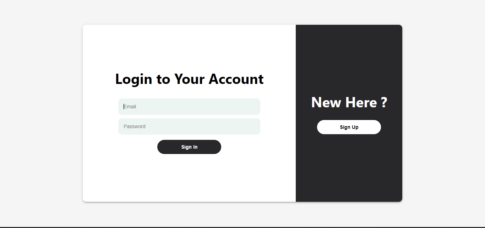
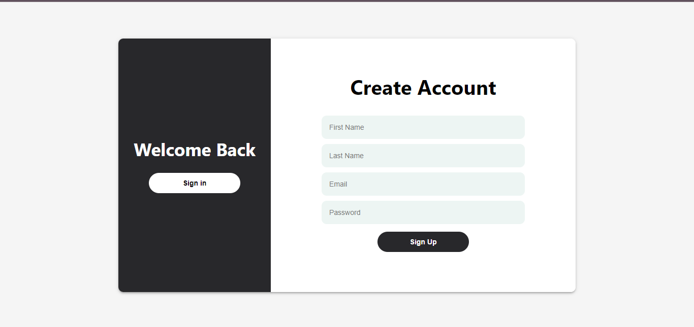
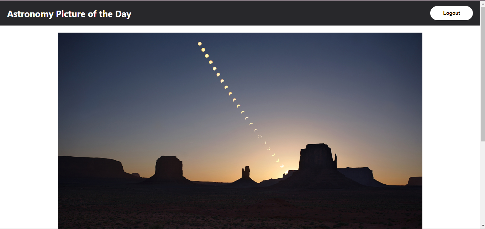
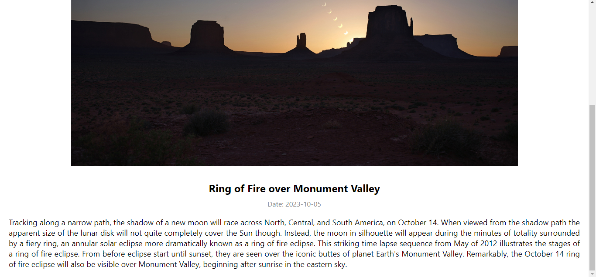

# NASA APOD Viewer

## About The Project

The NASA APOD (Astronomy Picture of the Day) Viewer is a single-page web application that lets users explore the cosmos by providing daily APOD images from NASA. Users can sign up, access protected routes, and view stunning images of the universe. This project combines frontend and backend technologies to create an engaging and informative experience for space enthusiasts.

## Features

- **User Signup and Sign In :** Users can sign up for an account, and their data is securely stored in a MongoDB database.

- **Protected Routes:** The application has protected routes that ensure only authorized users can access certain content, such as the daily APOD image.

- **Daily APOD:** Users can view the Astronomy Picture of the Day directly from NASA's collection.


- **Image Details:** Detailed information about each APOD image is available, including its title, date, and description.


## Tech Stack

### Frontend

- React: A JavaScript library for building user interfaces.
- CSS: For styling and layout.
- React Router: To handle client-side routing.
- Axios: For making HTTP requests to the backend.

### Backend

- Express: Node JS framework for making the robust apis.
- Axios: For making HTTP requests to external APIs.
- Bcrypt: For password hashing and user authentication.
- Joi: For data validation and schema definition.
- JSON Web Tokens (JWT): For user authentication and authorization.
- MongoDB: As the database to persistently store user data.

## Getting Started

To run the NASA APOD Viewer on your local machine, follow these steps:

### Frontend

1. Navigate to the `frontend` directory.
2. Create a `.env` file with the following content:

```plaintext
REACT_APP_SERVER_URL=YOUR_BACKEND_SERVER_URL
```

3. Install the required dependencies:

```bash
npm install
```

4. Start the development server:

```bash
npm start
```

5. Open your web browser and visit `http://localhost:3000` to access the NASA APOD Viewer frontend.

### Backend

1. Navigate to the `backend` directory.
2. Create a `.env` file with the following content:

```plaintext
DB=YOUR_MONGODB_URI
JWTPRIVATEKEY=YOUR_JWT_PRIVATE_KEY
NASA_API_KEY=YOUR_NASA_API_KEY
SALT=YOUR_SALT_VALUE
CLIENT_URL=YOUR_CLIENT_URL
```

3. Install the required dependencies:

```bash
npm install
```

4. Start the backend server:

```bash
npm dev 
```

## Screenshots

- Sign In Page

- Sign Up Page

- Apod Page showing Daily Image

- Apod Page Showing Details such as Title, Date and Explanation of Image



## Challenges and Solutions

The main challenge that I have face during the development of the project is in implementing a secure user authentication system and ensuring that only authorized users can access protected routes.
  - I Used JSON Web Tokens (JWT) for secure user authentication and authorization.
  - Then Created middleware that checks for a valid JWT token on protected routes.


## Acknowledgments

I would like to express our gratitude to:
- NASA: Acknowledge NASA for providing the APOD API and the stunning images.

- Open Source Community: Thankful to the open-source community for the valuable tools and libraries used in building the application.

- Online Resources: Most importantly 
